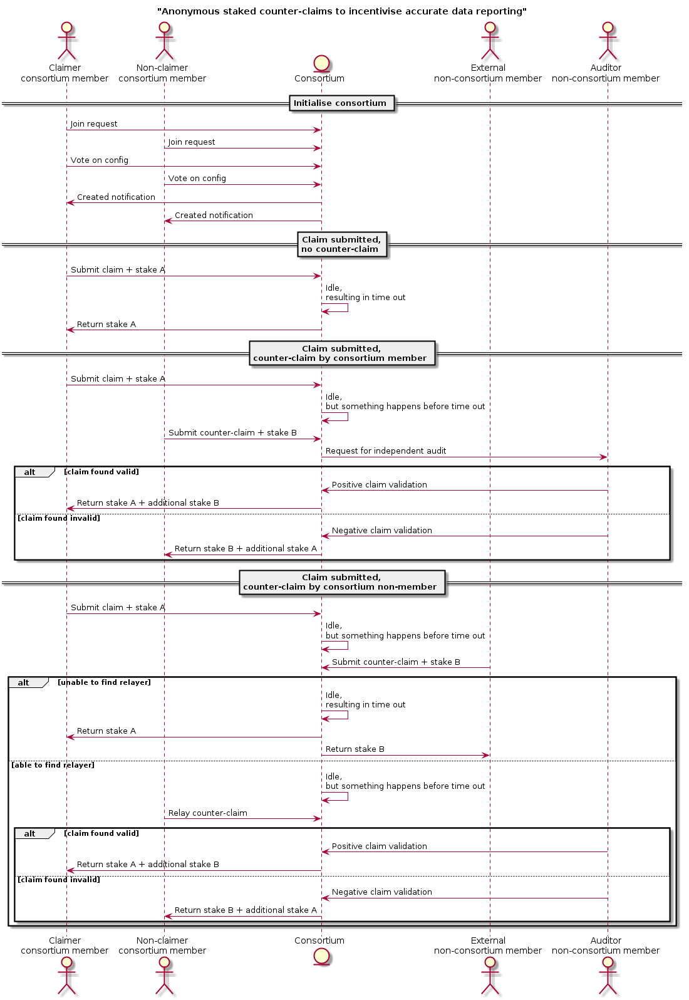

# Anonymous staked counter-claims to incentivise accurate data reporting

## How it works

- Actors required to report data in a particular field form a consortium
  - In which they agree to various values (configuration) that govern the operation of the consortium
- An actor within the consortium submits a claim to the consortium,
  which is the report data, and a staked amount
- When no other actor finds any fault with the reported data:
  - The staked amount is returned to the claiming actor
- When another actor within the consortium finds fault with the reported data:
  - This other actor submits a counter-claim to the consortium,
    which is the evidence of the fault in the claim,
    a zero-knowledge proof of membership of the consortium,
    and an additional staked amount
  - The consortium appoints an independent auditor
    to investigate the claim and counter-claim
- When another actor that is not within the consortium finds fault within the reported data:
  - This other actor submits a counter-claim to the consortium,
    which is the evidence of the fault in the claim,
    and an additional staked amount
  - Yet another actor within the consortium relays this external counter-claim,
    adding to it a zero-knowledge proof of membership of the consortium.
  - The consortium appoints an independent auditor
    to investigate the claim and counter-claim
- When an independent auditor is appointed
  - If the independent auditor upholds the original claim:
    - The claiming actor receives both staked amounts -
      which is a net profit to incentivise accurate claims
    - The counter-claiming actor loses their staked amount -
      which is a net loss to disincentivise inaccurate counter-claims
  - If the independent auditor upholds the counter-claim:
    - The claiming actor loses their staked amount -
      which is a net loss to disincentivise inaccurate claims
    - The counter-claiming actor receives both staked amounts -
      which is a net profit to incentivise accurate counter-claims

## UML sequence diagram

## Licence

GPL-3.0

## Author

[Brendan Graetz](http://bguiz.com)
